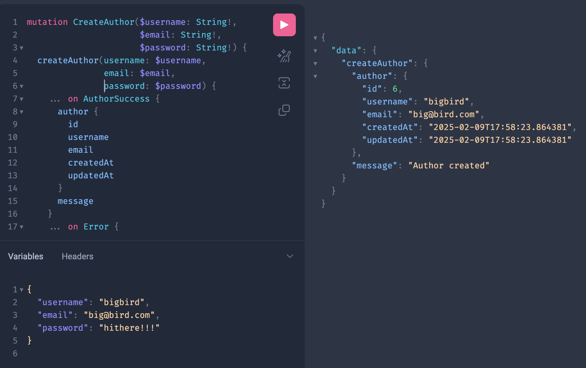
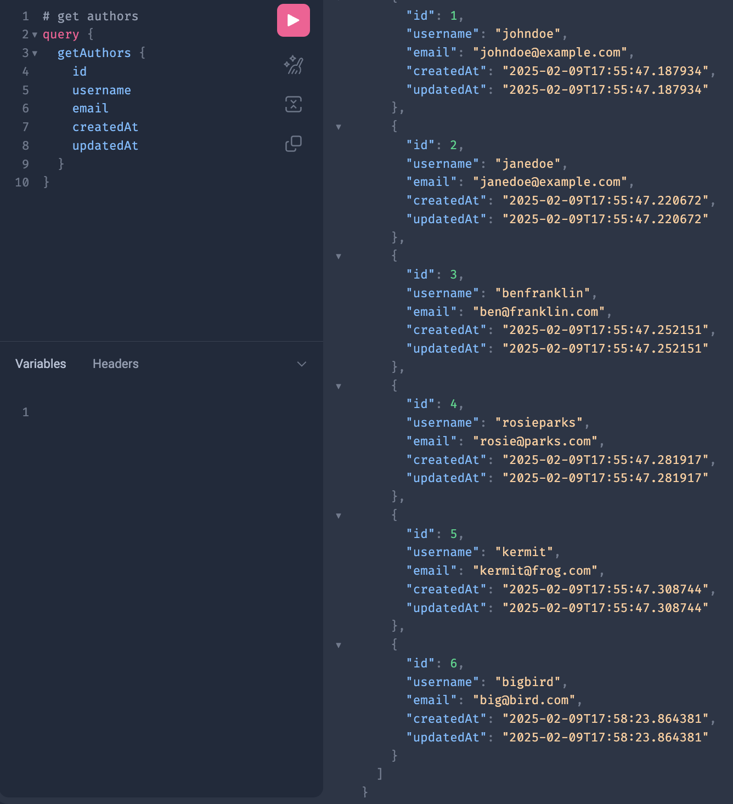

# blogger


### FastAPI app with GraphQL API to support blog data 

Build:  
```
docker compose build 
```
Run:
```
docker compose up -d
```

If Needed, Populate Database with FastAPI
```
http://localhost:8000/docs

POST to /populate-database/
```

Query Database:  GraphiQL
```
http://localhost:8000/graphql
```

Run Tests:
```
docker compose run --rm app pytest tests --asyncio-mode=strict
```

TODO:
1. Explicit, usable, resolvers
2. Authentication


Sample Queries:
```graphql
# create author
mutation CreateAuthor($username: String!, $email: String!, $password: String!) {
  createAuthor(username: $username, email: $email, password: $password) {
    ... on AuthorSuccess {
      author {
        id
        username
        email
        createdAt
        updatedAt
      }
      message
    }
    ... on Error {
      message
    }
  }
}
# variables 
{"username": "bigbird", "email": "big@bird.com", "password": "hithere!!!"}
```


```graphql
# get authors
query {
  getAuthors {
    id
    username
    email
    createdAt
    updatedAt
  }
}
```


**More examples:**
```graphql
# get author
query GetAuthor($id: Int!) {
  getAuthor(id: $id) {
    ... on AuthorSuccess {
      author {
        id
        username
        email
        createdAt
        updatedAt
      }
      message
    }
    ... on Error {
      message
    }
  }
}
# variables
{"id": 1}

# edit author
mutation EditAuthor($id: Int!, $username: String, $email: String, $password: String) {
  editAuthor(id: $id, username: $username, email: $email, password: $password) {
    ... on AuthorSuccess {
      author {
        username
        email
        password
        createdAt
        updatedAt
      }
      message
    }
    ... on Error {
      message
    }
  }
}
# variables
{"id": 5, "username": "new_username_5", "email": "new_email_5", "password": "new_password_5"}

# delete author
mutation DeleteAuthor($id: Int!) {
  deleteAuthor(id: $id) {
    ... on AuthorSuccess {
      author {
        id
        username
        email
        createdAt
        updatedAt
      }
      message
    }
    ... on Error {
      message
    }
  }
}
# variables
{"id": 1}
```
